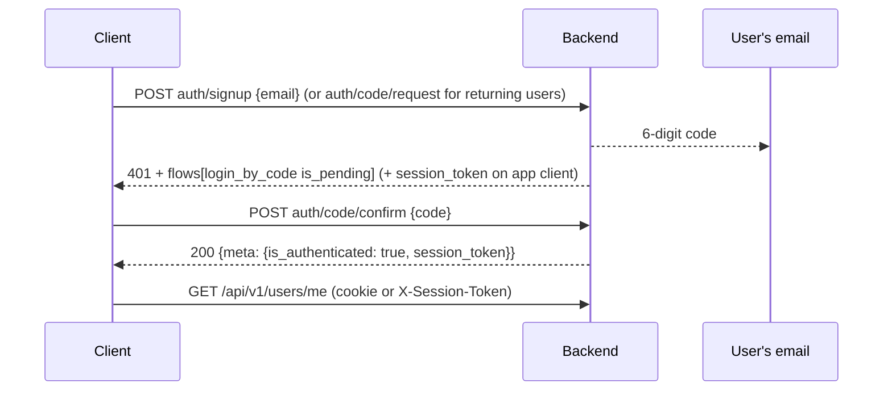

# Passwordless Auth — client guide

How frontend/mobile clients sign users up, in, and out. The backend uses
allauth headless: **no passwords, no JWT** — a 6-digit email code is both
signup verification and login, and authenticated calls ride a session.

Machine spec: `/_allauth/openapi.json` (auth) and `/api/v1/openapi.json`
(app API); the deployed Apidog project carries both merged.

## Pick your client mode

| | Browser (SPA) | App (mobile) |
|---|---|---|
| Base URL | `/_allauth/browser/v1` | `/_allauth/app/v1` |
| Credential | session **cookie** (set automatically) | `X-Session-Token` header (you store it) |
| CSRF | send `X-CSRFToken` from the `csrftoken` cookie on every POST | not needed |
| App API calls | cookie, same as above | `X-Session-Token` header |

The `/api/v1/` API accepts **either** credential.

## The one flow (new AND returning users)



1. **Signup**: `POST auth/signup` with `{"email": "..."}` — the response is
   **401 with `data.flows[]`** where `{"id": "login_by_code", "is_pending": true}`.
   That 401 is not an error: it means "authenticate by entering the emailed
   code". The code email doubles as email verification — there is no
   separate verify step.
2. **Returning login**: `POST auth/code/request` with `{"email": "..."}` —
   same pending state, same next step.
3. **Confirm**: `POST auth/code/confirm` with `{"code": "123456"}`.
   App client: send the `session_token` you got from step 1/2 as
   `X-Session-Token`, and **replace** it with the fresh one in the 200
   response. Browser client: the cookie updates automatically.
4. Call the API. `GET /api/v1/users/me` returns the profile.

Codes are **6 numeric digits** and expire after **3 minutes**
(`ACCOUNT_LOGIN_BY_CODE_TIMEOUT`). Requesting a code again invalidates the
previous one.

### Session lifecycle

- Check: `GET auth/session` → 200 while authenticated, 401 after expiry.
- Logout: `DELETE auth/session` → 401 body with the session ended
  (app client: also discard the stored token).
- Users can list/revoke their sessions via the `usersessions` endpoints in
  the auth spec.
- Account removal: `DELETE /api/v1/users/me` (app API) deactivates the
  account and kills every session immediately.

### Language

Send `Accept-Language: ar` or `en` on every request — error messages, code
emails and API strings localize (Arabic is the default). The language sent
**during signup** is saved as the user's preference for emails.

## Errors: two shapes, on purpose

**`/_allauth/` endpoints use allauth's native error format** (their spec
documents it):

```json
{"status": 400, "errors": [{"message": "...", "code": "invalid_or_expired_code", "param": "code"}]}
```

**`/api/v1/` endpoints use the project envelope**:

```json
{"message": "<localized>", "extra": {"code": "user_not_found", "fields": {"name": ["..."]}}}
```

Branch on `errors[].code` / `extra.code` — messages are localized text.

Catalog of auth cases you must handle:

| Case | Response |
|---|---|
| Wrong/expired code | 400, `code: "invalid_or_expired_code"` |
| Too many code requests (3 per email) | **400** (not 429), `code: "too_many_login_attempts"` — by design in allauth |
| Signups disabled (kill-switch) | 403 on `auth/signup` |
| Session expired / not authenticated | 401 with `meta.is_authenticated: false` |
| Deactivated account | 401 (code confirm refuses) |

## Local development

- Every email lands in **Mailpit**: <http://localhost:8025> — read codes
  there (they are also plain text in the message body).
- Backend base URL `http://localhost:8000`; CORS allows the origins in
  `FRONTEND_ALLOWED_ORIGINS` (default `http://localhost:5173`).
- Cross-port SPA dev: cookies are host-scoped, so `localhost:5173` can read
  the `csrftoken` cookie set by `localhost:8000`. If you develop against a
  different host (LAN IP, devices), prefer a dev-server proxy that makes
  the API same-origin — never disable CSRF (PLAN.md rule).
- The full flow is executable as a test:
  `apps/users/tests/test_apis.py::test_full_passwordless_flow_and_x_session_token`.
